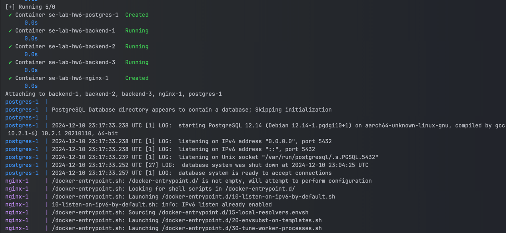
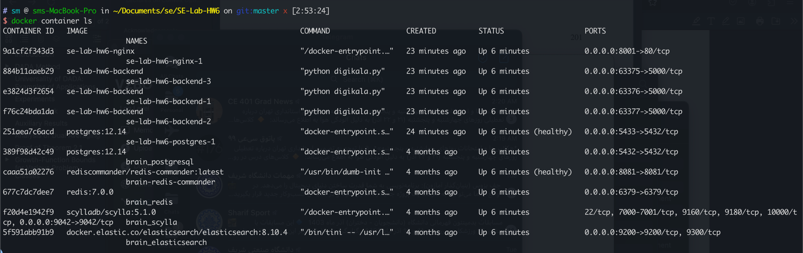
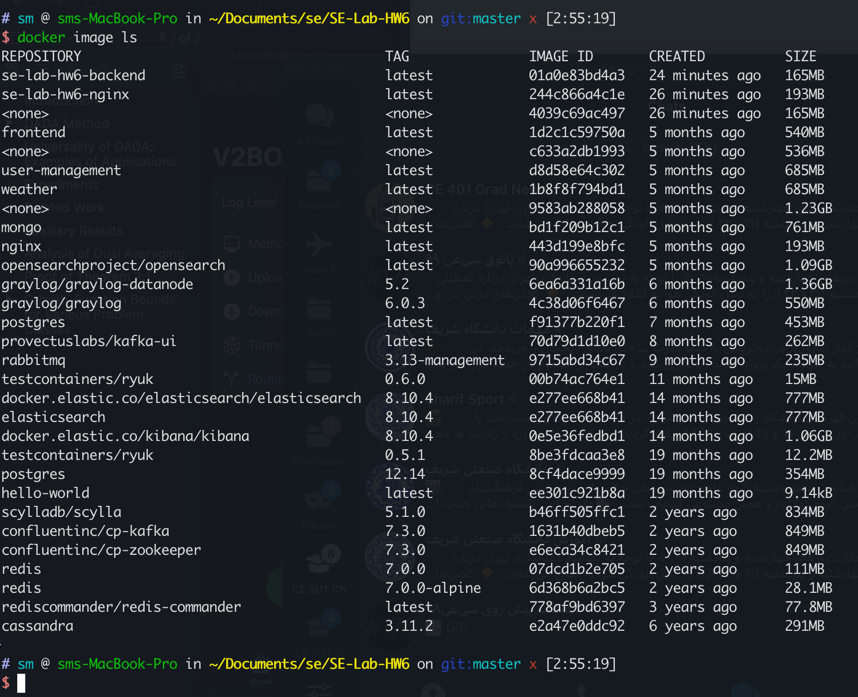
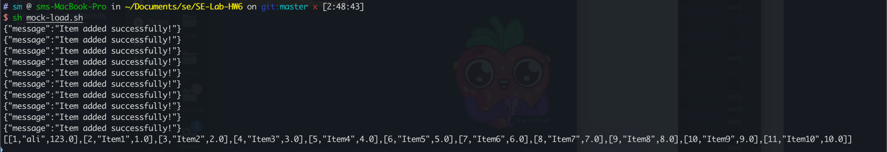
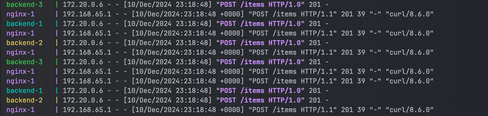
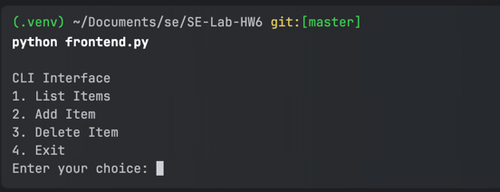

# [Kanban]()

در این پروژه ما قصد داریم یک فروشگاه کوچک با قابلیت اضافه کردن و حذف کردن کالا را دارد.

# Backend
در
backend
ما سه
سرویس
اصلی داریم.

1.  اضافه کردن کالا
2.  حذف کردن کالا
3.  لیست کردن کالاها

برای هرکدام از این سرویس‌ها یک
API
طراحی کردیم که می‌توانید با استفاده از آن‌ها با ماژول 
backend
ارتباط بگیرید. همچنین برای ذخیره کردن کالاها، از sql استفاده کردیم. در کد می‌توانید 
queryهایی
که به صورت
native 
نوشته‌ایم را مشاهده کنید. در نهایت 
backend 
را 
containerized
کردیم و برای اجرای آن از 
docker compose 
استفاده کردیم. همچنین با استفاده از قابلیت 
scale 
داکر، توانستیم سرویس خود را اسکیل کنیم. برای مثال با استفاده از کامند زیر می‌توانید سه نسخه از 
backend 
ما به همراه بقیه ماژول‌های مورد نیاز را اجرا کنید:
```bash
docker compose up --build --scale backend=3
```



به جای 3 می‌توانید هر تعداد که از backend نیاز دارید قرار بدهید. این مقدار را باید با توجه به لود سیستم در زمان‌های مورد نیاز تغییر دهیم. برای مثال در نزدیکی 
black friday 
احتمالا نیاز داریم تا سامانه را اسکیل کنیم و تعداد 
backendها 
را افزایش می‌دهیم. 

## خروجی دستورها 

### `docker container ls`


### `docker image ls`


# Interface
در این پروژه از 
nginx 
برای 
interface استفاده کردیم 
تا ریکوئست‌های بیرونی ابتدا به دست 
nginx 
برسند و سپس او تصمیم بگیرد که ریکوئست را به کدام 
backend 
بفرستد. با استفاده از این قابلیت 
nginx 
توانستیم 
load balancing 
را پیاده‌سازی کنیم. با همان دستوری 
docker compose 
بالا، nginx
هم اجرا می‌شود و به کار خود ادامه مي‌دهد.

برای تست می‌توانید اسکریپتی که درون فایل 
`mock-load.sh`
نوشته‌ایم را اجرا کنید. با زیاد کردن اندازه حلقه‌ی درون اسکریپت می‌توانید لود روی سامانه را بالاتر ببرید. خروجی این اسکریپت را می‌توانید در پایین ببینید. مشخصا لود بین 
backendها
پخش شده است.





# Frontend
جهت سهولت استفاده از سامانه و تست شما، یک ماژول جداگانه به نام 
frontend
طراحی کردیم که با استفاده از آن می‌توانید از سرویس‌های مختلفی که این سامانه ارائه می‌دهد استفاده کنید. 



# سوالات پایانی 

## سوال ۱ 
مفهوم stateless به معنای «بدون حالت» است.

به سیستمی یا برنامه‌ای گفته می‌شود که
هیچ اطلاعات یا حالتی از تعاملات قبلی خود را ذخیره نمی‌کند. 
در نتیجه، هر درخواست ورودی به سیستم باید تمامی اطلاعات لازم برای پردازش آن درخواست
را با خودش داشته باشد، بدون اینکه وابستگی‌ای به داده‌های ذخیره‌شده از قبل داشته باشد.

در این آزمایش مفهوم stateless در آنجا استفاده شد که نیاز داشتیم سرویس‌های معماری میکروسرویس‌مان به صورت مستقل کار کنند و هیچ حالتی را در خود نگه ندارند. این موضوع به موارد زیر کمک کرد:

1. توزیع بار (Load Balancing): هر درخواست می‌تواند به هر کدام از سرویس‌ها ارسال شود بدون نگرانی از اینکه درخواست قبلی به کدام سرویس ارسال شده است.
2. افزایش مقیاس‌پذیری: سرویس‌ها به راحتی می‌توانند بر اساس نیاز مقیاس داده شوند، زیرا اطلاعات حالت در سرویس ذخیره نشده و وابستگی به سرویس خاصی وجود ندارد.
3. سادگی مدیریت: به دلیل نبود اطلاعات ذخیره‌شده در خود سرویس (منظور اینجا اطلاعات ذخیره شده در دیتابیس نیست)، سرویس‌ها ساده‌تر راه‌اندازی، نگهداری و جایگزینی می‌شوند.
این رویکرد در داکر و میکروسرویس‌ها معمولاً با استفاده از APIهای RESTful پیاده‌سازی می‌شود، که به طور پیش‌فرض stateless هستند و داده‌های مورد نیاز در هر درخواست به همراه ارسال می‌شوند که در این آزمایش هم به همین صورت عمل کردیم.

## سوال ۲ 
مزیت‌های توزیع بار در لایه‌ی ۴:
لود بالانسینگ در لایه‌ی انتقال مستقل از محتوای پیام است و صرفا بر اساس پروتکل TCP/UDP و موارد مربوط به آن پیام‌ها را پخش می‌کند. به همین دلیل (سادگی) پردازش آن سریعتر انجام میشود.
همچنین از آنجا که به پروتکل لایه‌ی اپلیکیشن وابسته نیست، رنج بزرگتری از پیام های سرویس‌ها مانند VoIP یا FTP هم می‌تواند استفاده شود.
به دلیل سرعت بالاتر آن قابلیت مقیاس‌پذیری بیشتری هم دارد.

مزیت‌های توزیع بار در لایه‌ی ۷:
لود بالانسینگ در لایه‌ی اپلیکیشن امکان دسترسی به محتوای پیام شامل کوکی‌ها، هدر یا محتوای بدنه را فراهم می‌کند و می‌توان الگوریتم‌های پیچیده‌تری برای نحوه‌ی توزیع بار برای آن تعریف کرد. همچنین با تحلیل محتوای پیام می‌تواند برخی حملات امنیتی را شناسایی و از آن جلوگیری کند.

در این پروژه ما از nginx استفاده کردیم تا بتوانیم توزیع بار در لایه‌ی ۷ را برای اپلیکیشن خود فراهم آوریم.
